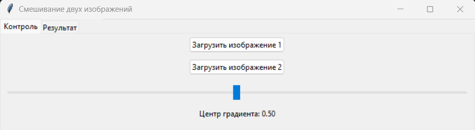
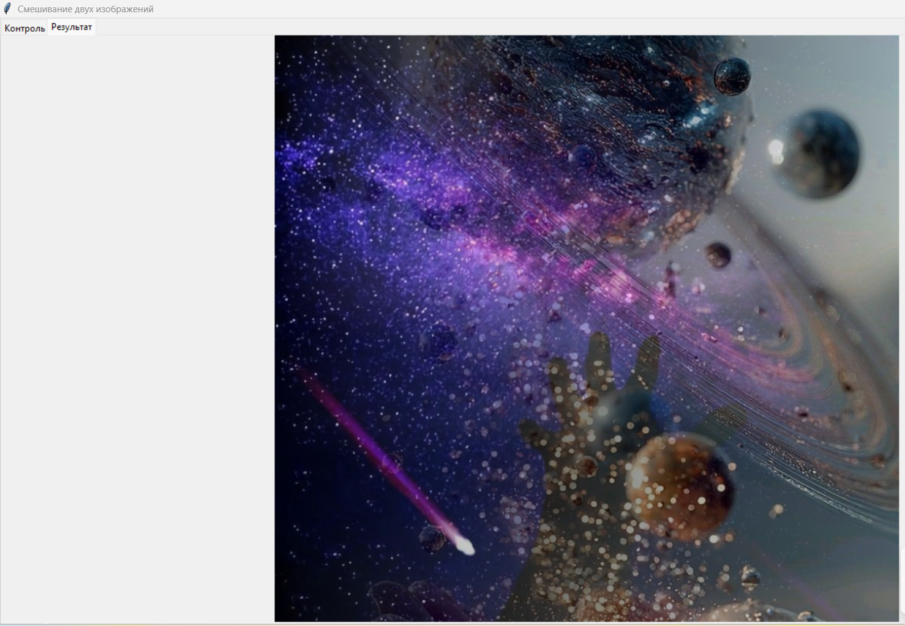

# Image Blender — Плавное смешивание двух изображений
Приложение для смешивания двух изображений с использованием горизонтальной градиентной маски. Поддерживает предпросмотр результата, выбор положения границы смешивания и сохранение итогового изображения.

## Возможности
Загрузка двух изображений.

Автоматическая подгонка размера второго изображения под первое.

Плавное смешивание через горизонтальный градиент.

Управление положением границы смешивания с помощью ползунка.

Предпросмотр результата в реальном времени.

Сохранение итогового изображения в PNG или JPEG.
## Установка зависимостей
```bash
python -m venv .venv
.venv\Scripts\activate
pip install -r requirements.txt
```
## Запуск
```bash
python BlendApp.py
```
## Использование
1. Перейдите на вкладку **Управление** и загрузите два изображения.
2. Переместите ползунок, чтобы изменить положение границы смешивания.
3. Перейдите на вкладку **Результат**, чтобы увидеть итоговое изображение.
4. Нажмите **Сохранить результат**, чтобы сохранить изображение в PNG или JPEG.

## Скриншоты
Ниже приведены примеры работы приложения.

### Вкладка «Управление»


### Вкладка «Результат»

